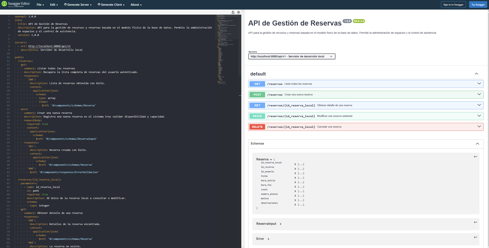

# Analisis del dominio. Sistema de gestion de reservas.

## 1. Intruducción.

    El objetico de esta API es permitir la gestion de reserva de recursos (salas, pistas...) por parte de usuarios registrados. 
    El flujo de datos comienza en la base de datos del sistema de gestion de reservas creada en la asignatura de Bases de datos, 
    desde donde la API extraerá informacion estructurada para presentarla al cliente final (frontend) y procesará las peticiones 
    de creación, consulta, edición y borrado (CRUD).

## 2. Entidades y tablas participantes.

    Para gestionar las reservas, se usaran cuatro tablas interconectadas:

        - Tabla principal: Reserva, almacena quien reserva, que reserva, cuando reserva y las condiciones (coste, plazas, motivo).

        - Tablas de usuarios (usuario, usuaruinormal, administrador): La API verificara que el id_usuario que hace la reserva existe 
          y es tipo normal. No permitirá que un administrador realice reservas.

        - Tabla de recursos: Recurso, contiene los datos de las reservas (nombre, ubicación, capacidad). Esta tabla proporciona 
          al usuario las opciones disponibles que tiene para realizar el POST en la reserva.

        - Tablas de disponibilidad (horario y disponibleen): La API de reservas se centra en la tabla reserva, pero debe consultar 
          estas tablas para asegurarse de que el recurso que se esta solicitando está   disponible en las horas elegidas.

## 3. Definición de la Entidad "Reserva" en la API.

    En la base de datos, la tabla reserva tiene una clave primaria compuesta (id_recurso, id_reserva_local), pero para la API lo 
    simplificaremos.

    Campos de la BBDD y campos expuestos en la API.

### Tabla de Mapeo de Datos

| Campo BBDD | Tipo de dato | ¿Expuesto en API? | Razón / Origen |
|:--- | :---: | :---: | ---: |
| id_recurso | INT | SI | Obligatorio para identificar el activo.|
| id_reserva_local | INT | SI | Identificador único de la reserva.|
| id_usuario | INT | SI | Identifica al cliente. |
| fecha | DATE | SI | Dia de la reserva. |
| hora_inicio | TIME | SI | Inicio del uso del recurso. |
| hora_fin | TIME | SI | Fin del uso del recurso. |
| coste | DECIMAL | SI | Calculado o informatico para el usuario. |
| numero_plazas | INT | SI | Cantidad de personas que asistirán. |
| motivo | VARCHAR | SI | Descripción breve del uso. |
| observaciones | VARCHAR | SI | Notas adicionales. |

### Datos generados automáticamente y campos ocultos:

    - Claves Primarias: El id_reserva_local es gestionado internamente por la lógica de negocio o la base de datos para evitar 
      conflictos dentro de un recurso.

    - Datos no expuestos: En las peticiones de reserva, no se mostrarán las contraseñas de la tabla usuario ni datos sensibles 
      como la fotografia del usuario normal, ya que no son necesarios para la gestión del recurso y suponen un riesgo de seguridad.

## 4. Reglas de negocio y validaciones.

    Para garantizar la integridad del sistema de reservas, la API aplicará las siguientes reglas de validación antes de persisteir 
    cualquier dato en SQL:

    1. Validaciones de integridad (Campos obligatorios).

        * Toda reserva debe incluid de manera obligatoria: id_recurso, id_usuario, fecha, hora_inicio y hora_fin. 
          Sin estos parámetros, la API devolverá un error 400 Bad Request.

    2. Restricciones de valores y rangos.

        * El numero_plazas de la reserva no puede ser superior al campo capacidad de la tabla recurso. Ej. No se puede 
          reservar una sala de 10 personas para un grupo de 15.
        * La fecha de la reserva debe ser igual o posterior a la fecha actual del sistema. No se permiten reservas con 
          fecha de antes del dia actual.
        * La hora_fin debe ser posterior a la hora_inicio. No se podran efectuar reservas si la hora_fin es anterior a 
          la hora_inicio.

    3. Lógica específica

        * Antes de confirmar un INSERT en la tabla reserva, el sistema verificará en la tabla disponibleen si el recurso 
          tiene asignado un horarios compatible.
        * Solo los usuarios cuya entrada en la tabla usuario tenga el tipo_usuario normal estan autorizados a aparecer 
          como propietarios de una reserva. Un ID perteneciente a un administrador será rechazado por la lógica de negocio de la API.
        * Aunque el campo coste existe en la base de datos , la API podría calcularlo automaticamente multiplicando 
          la duración de la reserva por una tarifa base del recurso antes de guardar el recurso.

    

